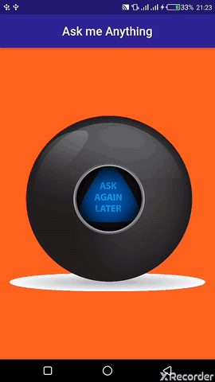

# Magic 8 ball

A Magical 8 ball app built with flutter, a fun app which gives you the answers to all the tricky questions in life.
Ask any question and press on the ball to give you your answer.
The ball displays random answers at the press of the button(ball image) and also the background color also displays random colors.

## Demo

## Getting Started

* Click on the 'Clone or download' button and select 'Download Zip.'
* Move to the project directory and run `flutter pub get` in your terminal or from Android Studio, 
click on `packages Get` to install the packages
* Run `flutter run` to run the project in your emulator
